# Git Commands Explained
## Table of Contents
1. [Basic Workflow](#1-basic-workflow)
   - [git init](#a-git-init)
   - [git status](#b-git-status)
   - [git add](#c-git-add)
   - [git commit](#d-git-commit)

2. [Viewing Changes](#2-viewing-changes)
   - [git log](#a-git-log)
   - [git diff](#b-git-diff)

3. [Remote Commands](#3-remote-commands)
   - [git push](#a-git-push)
   - [git pull](#b-git-pull)
   - [git fetch](#c-git-fetch)

4. [Branching](#4-branching)
   - [git branch](#a-git-branch)
   - [git switch](#b-git-switch)
   - [git merge](#c-git-merge)

5. [Undo and Fixing](#5-undo-and-fixing)
   - [git restore](#a-git-restore)
   - [git reset](#b-git-reset)
   - [git revert](#c-git-revert)
## 1. Basic Workflow
### a. `git init`
#### Description
Initializes a new Git repository in the current folder.
#### Command
```bash
git init
```
#### Example Output
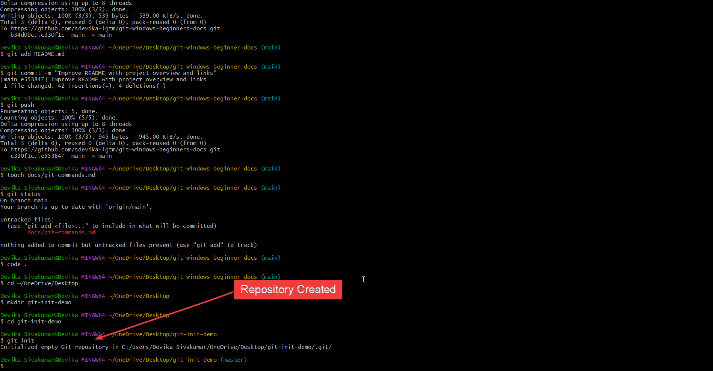
#### Explanation
- Creates a new Git repository
- Generates a hidden `.git` folder
- Enables version control for the project
#### When to Use
Use this command when starting a new project that you want Git to track.
### b. `git status`
#### Description
Shows the current state of the repository.
#### Command
```bash
git status
```
#### Example Output
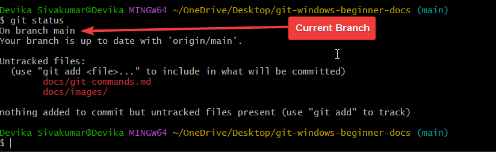
#### Explanation
This output shows that Git has detected new files and folders that are not yet being tracked.

In this example:

- `docs/git-commands.md` is a new Markdown file
- `docs/images/` is a new folder
- these items are currently untracked
- they must be added with `git add` before they can be committed
#### When to Use
Use this command to check whether your repository has untracked, modified, or staged files before committing changes.
### c. `git add`
#### Description
Adds files to the staging area.
#### Command
```bash
git add .
```
#### Example Output
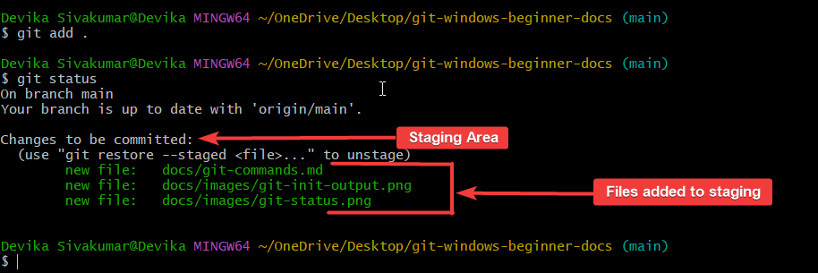

#### Explanation
- Moves files from untracked to staged
- Prepares files for committing
- The staging area holds changes before they are saved permanently
#### When to Use
Use this command after creating or modifying files to prepare them for a commit.
### d. `git commit`
#### Description
Creates a snapshot of the staged changes and saves it in the repository history.
#### Command
```bash
git commit -m "Add git commands documentation"
```
#### Example Output
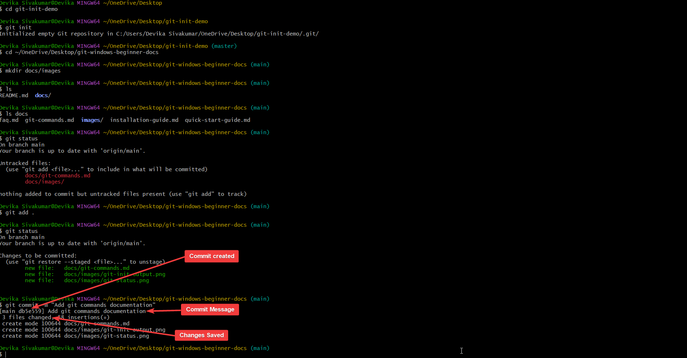
#### Explanation
- Saves staged changes permanently
- Creates a new commit with a message
- Each commit represents a version of the project
#### When to Use
Use this command after staging changes to record them in Git history.
## 2. Viewing Changes
### a. `git log`
#### Description
Displays the commit history of the repository.
#### Command
```bash
git log
```
#### Example Output
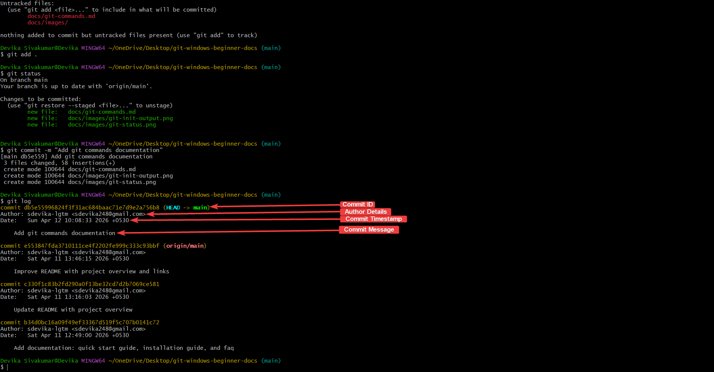
#### Explanation
- Shows commit history
- Each commit has a unique ID
- Displays author, date, and message
#### When to Use
Use this command to review past commits and track changes over time.
### b. `git diff`
#### Description
Shows differences between file versions.
#### Command
```bash
git diff
```
#### Example Output
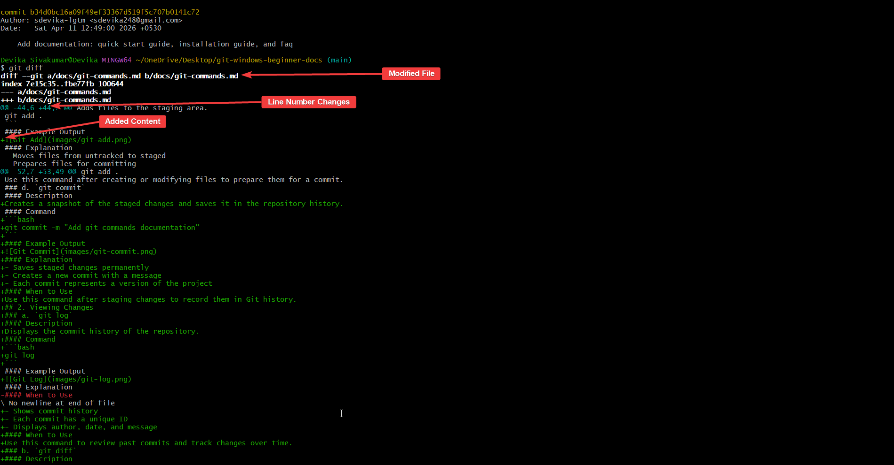
#### Explanation
- Displays changes in files
- Lines starting with `+` are additions
- Lines starting with `-` are deletions
#### When to Use
Use this command to review changes before staging or committing them.
## 3. Remote Commands
### a. `git push`
#### Description
Uploads local commits to the remote repository, like GitHub.
#### Command
```bash
git push
```
#### Example Output
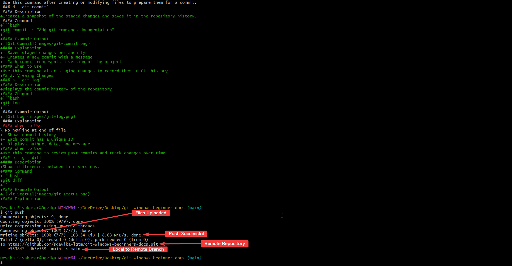
#### Explanation
- Sends commits to GitHub
- Updates remote repository
- Keeps local and remote in sync
#### When to Use
Use this command after committing changes to upload them to GitHub.
### b. `git pull`
#### Description
Fetches and merges changes from the remote repository.
#### Command
```bash
git pull
```
#### Example Output

#### Explanation
- Downloads changes from GitHub
- Merges them into your local branch
#### When to Use
Use this command to update your local repository with the latest changes.
### c. `git fetch`
#### Description
Downloads changes from the remote repository without merging them.
#### Command
```bash
git fetch
```
#### Example Output

#### Explanation
- Retrieves updates from GitHub
- Does not modify local files
- Allows you to review changes before merging
#### When to Use
Use this command when you want to see remote changes before applying them.
## 4. Branching
### a. `git branch`
#### Description
Lists and creates branches.
#### Command
```bash
git branch
```
#### Example Output
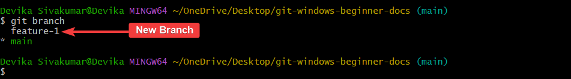
#### Explanation
- Shows all branches
- `*` indicates the current branch
#### When to Use
Use this command to view or create branches.
### b. `git switch`
#### Description
Switches to another branch.
#### Command
```bash
git switch
```
#### Example Output
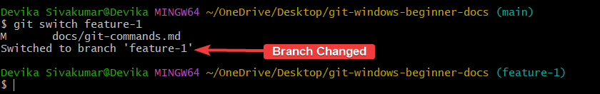
#### Explanation
- Moves you to a different branch
- Changes your working directory context
#### When to Use
Use this command to work on a different branch.
### c. `git merge`
#### Description
Merges changes from one branch into another.
#### Command
```bash
git merge feature-1
```
#### Example Output

#### Explanation
- Combines changes from branches
- Updates the current branch
#### When to Use
Use this command to integrate changes from another branch.
## 5. Undo and Fixing
### a. `git restore`
#### Description
Discards changes in the working directory.
#### Command
```bash
git restore docs/git-commands.md
```
#### Example Output
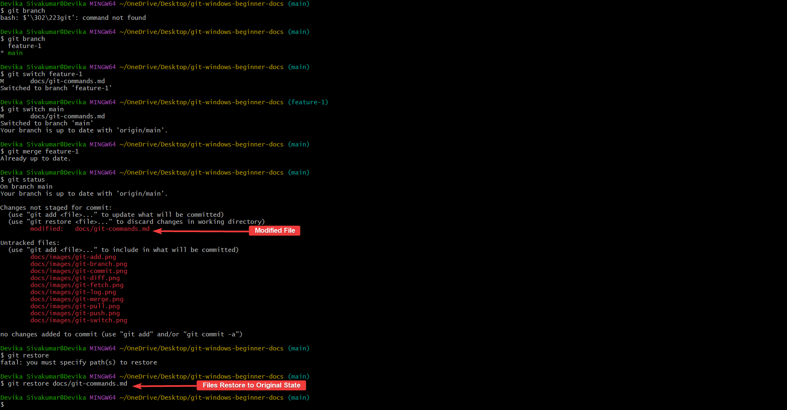
#### Explanation
- Removes uncommitted changes
- Restores file to last committed state
#### When to Use
Use this command to undo changes that you do not want to keep.
### b. `git reset`
#### Description
Unstages files from the staging area.
#### Command
```bash
git reset
```
#### Example Output

#### Explanation
- Moves files out of staging
- Does not delete changes
#### When to Use
Use this command when you accidentally staged files.
### c. `git revert`
#### Description
Creates a new commit that reverses a previous commit.
#### Command
```bash
git revert <commit-id>
```
#### Example Output
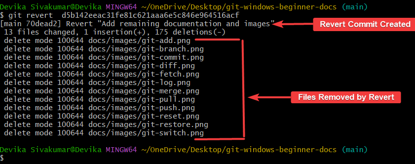
#### Explanation
- Safely undoes a commit
- Does not remove history
#### When to Use
Use this command to undo changes that have already been committed.

